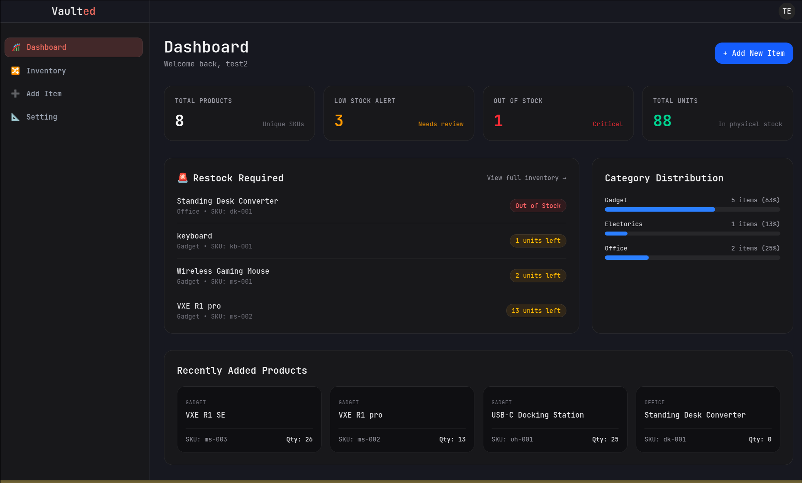

# Vaulted 🔒

> A secure, modern web application designed for fast data management and seamless access control. Built with Next.js and Neon, Vaulted provides a reliable foundation ready for instant deployment and live production tweaks.

---



## 🚀 Features

- **Robust Authentication**: Powered by Neon Auth for modern, secure user identity management and role-based access.
- **High-Performance Database**: Serverless PostgreSQL integration for instant scaling, low latency, and efficient querying.
- **Modern Next.js Architecture**: Server-Side Rendering (SSR) and API routes for optimal speed, SEO, and responsiveness.
- **Production Ready**: Fully configured for continuous integration and seamless deployment on Vercel.

---

## 🛠️ Tech Stack

- **Frontend**: Next.js (React)
- **Backend**: Next.js API Routes / Server Actions
- **Database**: Serverless PostgreSQL (Neon)
- **Authentication**: NeonAuth
- **Hosting / Deployment**: Vercel

---

## 📂 Project Structure

```text
Vaulted/
├── app/                  # Next.js App Router (pages, layouts, and API routes)
│   ├── api/             # API route endpoints
│   ├── (auth)/          # Authentication routes & pages
│   └── page.tsx         # Main entry page
├── components/          # Reusable UI components
├── lib/                 # Utility functions, database client & Neon configurations
├── public/              # Static assets (images, icons, etc.)
├── .env.example         # Template for environment variables
├── package.json         # Project dependencies and scripts
└── README.md            # Project documentation
```
